# 💊 MedRemind

A modern Laravel 12 based Medicine Reminder & Medication Tracking System that helps users manage medicines, schedules, reminders, notifications, and daily medicine compliance from a centralized dashboard.

---

## 🚀 Overview

MedRemind is a multi-user medicine reminder platform built with Laravel 12.

The application allows users to:

- Manage medicines
- Create weekly schedules
- Generate automatic reminders
- Receive email notifications
- Track medicine intake status
- Monitor upcoming and historical reminders
- View dashboard analytics

The goal is to ensure users never miss their medications and can easily track their medicine adherence.

---

# ✨ Key Highlights

- 🔐 Multi User Authentication - laravel/breeze
- 💊 Medicine Management (CRUD)
- 📅 Schedule Management (CRUD)
- ⏰ Automatic Reminder Generation
- 📧 Email Notifications
- 🔔 Database Notifications
- 📊 Dashboard Analytics
- 📋 Upcoming Reminders
- 📜 Reminder History
- ✅ Medicine Taken / Missed Tracking
- ⚙️ Laravel Events & Listeners
- 📨 Queue Processing
- 🕒 Scheduler & Cron Jobs

---

# 📸 Application Screenshots

## 🏠 Landing Page

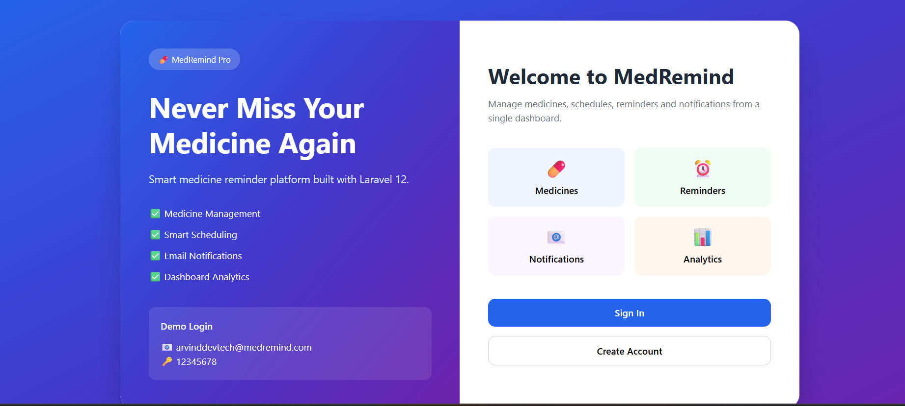

---

## 🔐 Login Page

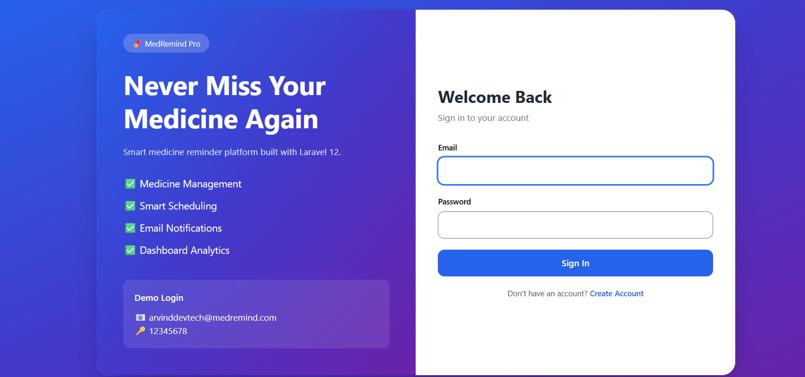

---

## 📝 Register Page

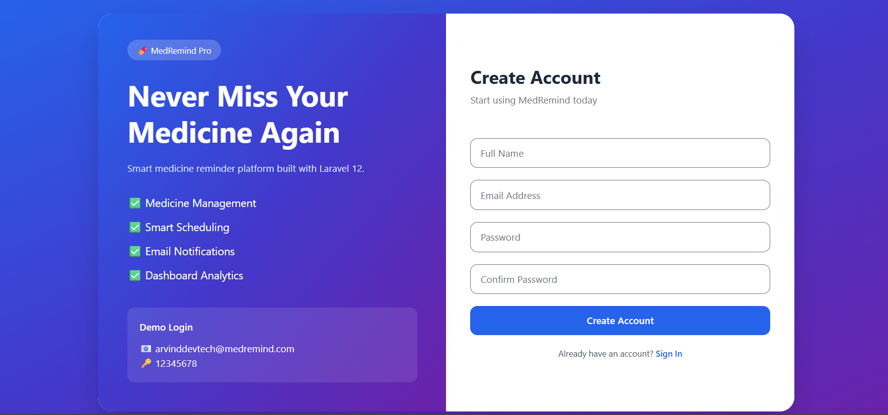

---

## 📊 Dashboard

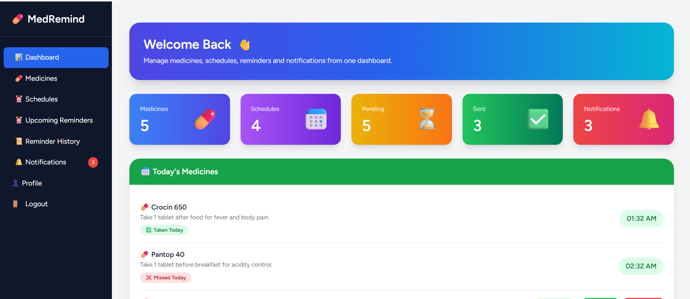

### Today's Medicines Taken / Missed

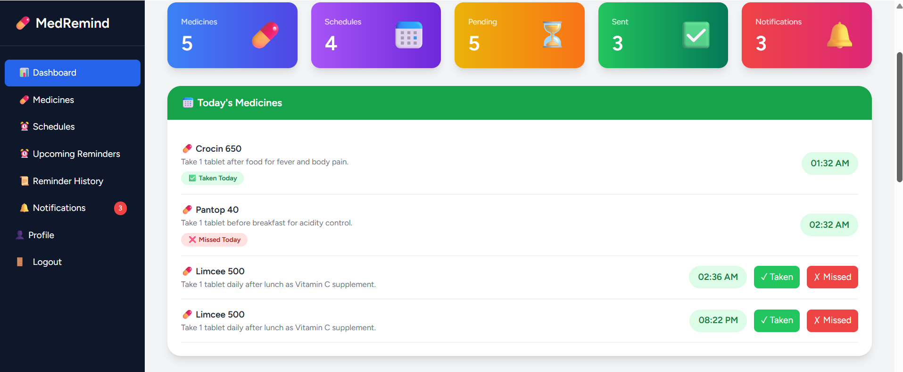

### Recent Medicines

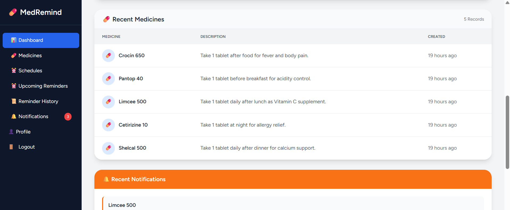

### Recent Notifications

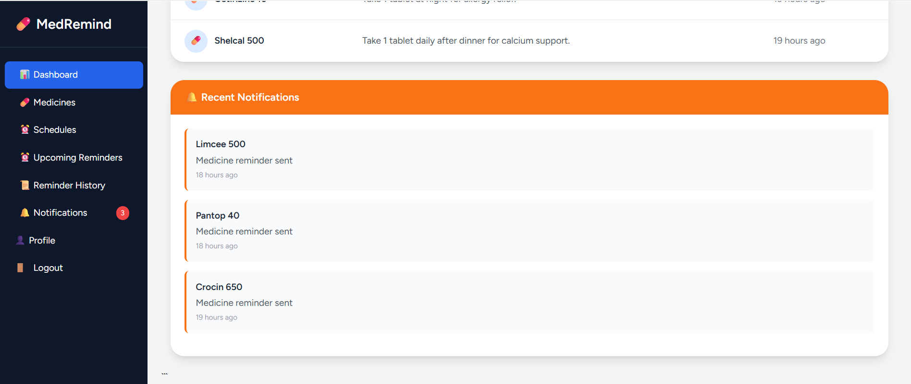

---

## 💊 Medicines Management

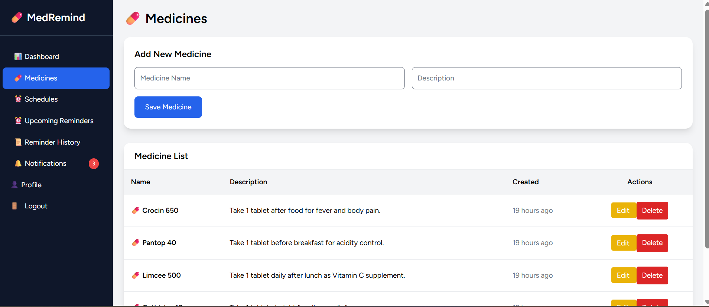

Features:

- Add Medicine
- Update Medicine
- Delete Medicine
- View Medicine List

---

## 📅 Schedule Management

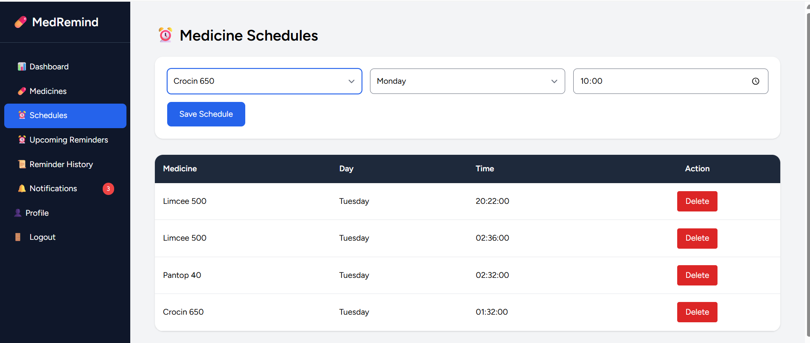

Features:

- Create Weekly Schedule
- Edit Schedule
- Delete Schedule
- Manage Reminder Time

---

## ⏰ Upcoming Reminders

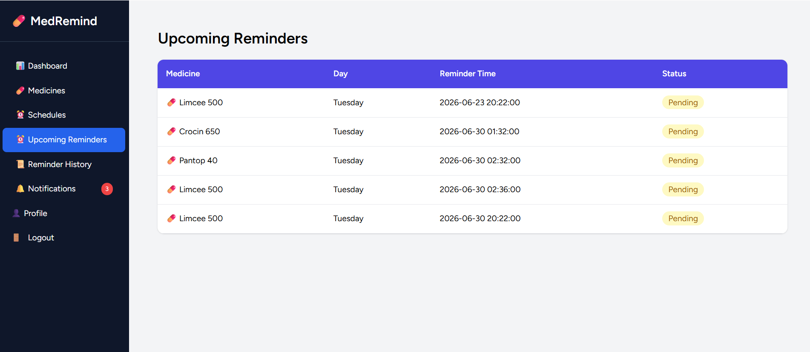

Users can monitor upcoming medicine reminders and plan medication intake accordingly.

---

## 📜 Reminder History

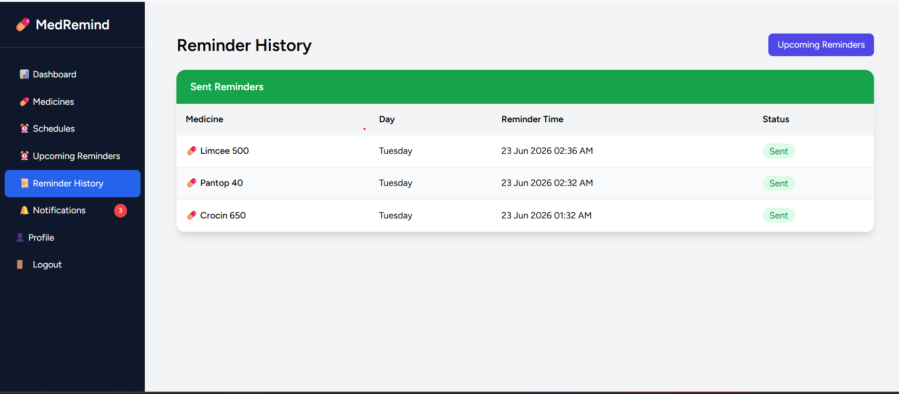

Tracks all processed reminders and reminder status history.

---

## 🔔 Notifications

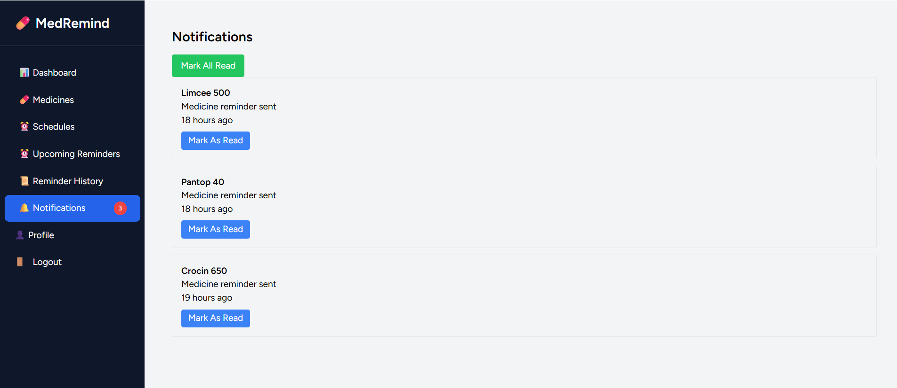

Stores all database notifications generated by reminder processing.

---

## 📧 Email Reminder

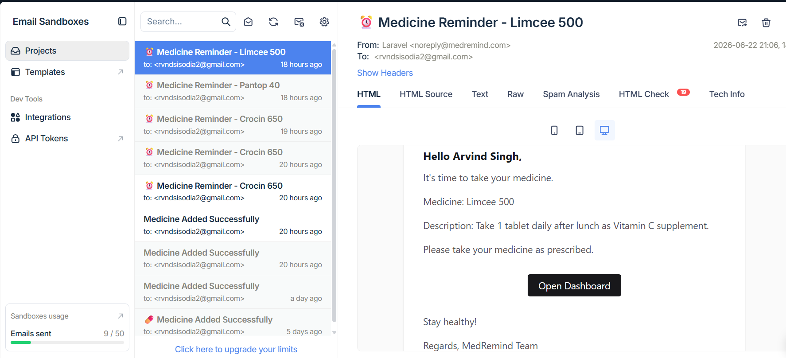

Automated email reminders sent when medicine schedules become due.

---

# ✨ Features

## 🔐 Authentication

- User Registration
- User Login
- User Logout
- Profile Management
- User Data Isolation

Each user can only access their own medicines, schedules, reminders, and notifications.

---

## 💊 Medicine Management

Users can:

- Add Medicines
- Update Medicines
- Delete Medicines
- View Medicine List

| Name       | Description         |
| ---------- | ------------------- |
| Crocin 650 | Fever & Pain Relief |
| Dolo 650   | Pain Killer         |
| Vitamin C  | Daily Supplement    |

---

## 📅 Schedule Management

Create medicine schedules:

| Medicine   | Day     | Time     |
| ---------- | ------- | -------- |
| Crocin 650 | Tuesday | 08:00 PM |
| Vitamin C  | Monday  | 09:00 AM |

Supported Features:

- Weekly Scheduling
- Multiple Medicines
- Multiple Schedule Times

---

## ⏰ Reminder Engine

When a schedule is created:

1. ScheduleCreated Event is fired.
2. GenerateReminders Listener executes.
3. Current Week Reminder is generated.
4. Next Week Reminder is generated automatically.

Example:

Schedule:

Tuesday 08:00 PM

Generated Reminders:

- 24 Jun 2026 08:00 PM
- 01 Jul 2026 08:00 PM

---

## 📧 Email Notifications

Automatic email notifications are sent when reminders are processed.

Email includes:

- Medicine Name
- Reminder Message
- Dashboard Link

---

## 🔔 Database Notifications

Notifications are also stored inside Laravel's notifications table.

Benefits:

- Notification History
- User Dashboard Alerts
- Future Mobile Push Support

---

## ⚙️ Automated Reminder Processing

Custom Laravel Command:

```bash
php artisan medicine:process-reminders
```

Processes:

- Pending reminders
- Sends notification
- Sends email
- Marks reminder as sent
- Generates future reminder

---

## 📊 Dashboard Analytics

Dashboard displays:

- Total Medicines
- Total Schedules
- Pending Reminders
- Sent Reminders
- Recent Medicines
- Recent Notifications

---

## 📋 Upcoming Reminders

Users can view:

- Upcoming Reminder Date
- Reminder Time
- Medicine Name

Useful for planning medication schedules.

---

## 📜 Reminder History

Users can view:

- Sent Reminders
- Reminder Date
- Medicine Information
- Notification Status

---

## ✅ Medicine Tracking

Users can mark medicines as:

- Taken
- Missed

Daily logs are stored.

Example:

| Medicine   | Status |
| ---------- | ------ |
| Crocin 650 | Taken  |
| Vitamin C  | Missed |

---

## 👥 Multi User Support

Each user has:

- Own Medicines
- Own Schedules
- Own Reminders
- Own Notifications

Data is fully isolated.

---

# 🔄 System Workflow

## Step 1

User Registers

↓

## Step 2

User Adds Medicine

↓

## Step 3

User Creates Schedule

↓

## Step 4

ScheduleCreated Event Fires

↓

## Step 5

GenerateReminders Listener Creates:

- Current Week Reminder
- Next Week Reminder

↓

## Step 6

Laravel Scheduler Runs

↓

## Step 7

ProcessReminders Command Executes

↓

## Step 8

Email Notification Sent

↓

## Step 9

Database Notification Stored

↓

## Step 10

User Marks Medicine:

- Taken
- Missed

↓

## Step 11

Dashboard Analytics Updated

---

# 🛠 Tech Stack

Backend

- Laravel 12
- PHP 8+
- MySQL

Frontend

- Blade
- Tailwind CSS

Laravel Components

- Authentication
- Events
- Listeners
- Notifications
- Queues
- Scheduler
- Mail

---

# 📦 Installation

Clone Repository

```bash
git clone https://github.com/YOUR_USERNAME/medremind.git
```

Move Into Project

```bash
cd medremind
```

Install Dependencies

```bash
composer install
```

Install Node Packages

```bash
npm install
```

Build Assets

```bash
npm run build
```

Copy Environment

```bash
cp .env.example .env
```

Generate Application Key

```bash
php artisan key:generate
```

Configure Database Inside .env

```env
DB_DATABASE=medremind
DB_USERNAME=root
DB_PASSWORD=
```

Run Migrations

```bash
php artisan migrate
```

Run Seeders

```bash
php artisan db:seed
```

Start Application

```bash
php artisan serve
```

---

# 🌱 Seeders

Included:

- DemoUserSeeder
- MedicineSeeder

Run:

```bash
php artisan db:seed
```

Fresh Install:

```bash
php artisan migrate:fresh --seed
```

---

# 📬 Mail Configuration

Configure Mailtrap / Gmail inside:

```env
MAIL_MAILER=smtp
MAIL_HOST=
MAIL_PORT=
MAIL_USERNAME=
MAIL_PASSWORD=
MAIL_FROM_ADDRESS=
```

---

# ⏳ Queue Worker

Start Queue Worker

```bash
php artisan queue:work
```

---

# 🕒 Scheduler Setup

Manual Test

```bash
php artisan medicine:process-reminders
```

Laravel Scheduler

```bash
php artisan schedule:work
```

Production Cron

```bash
* * * * * php /path-to-project/artisan schedule:run >> /dev/null 2>&1
```

---

# 🧪 Demo Account

Email:

```text
arvinddevtech@medremind.com
```

Password:

```text
12345678
```

---

# 🚀 Future Enhancements

### Analytics

- Adherence Analytics
- Weekly Reports
- Monthly Reports

### Charts

- Chart.js Dashboard
- Weekly Trends
- Monthly Trends

### Notifications

- WhatsApp Notifications
- SMS Notifications
- Push Notifications
- Snooze Reminders

### SaaS

- Multi-Tenant Architecture
- Organizations
- Family Accounts
- Roles & Permissions
- Subscription Billing

---

# 👨‍💻 Author

Arvind Singh

PHP / Laravel / Codeigniter / CMS- Wordpress,opencart Developer

Experience: 9+ Years

---

# 📄 License

MIT License
